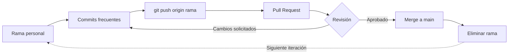

# Flujo de trabajo con Git — MovieHub

Guía para que los 5 integrantes trabajemos sin pisarnos el código. Léela antes de tu primer commit.
---

## ⏱️ El flujo diario en 3 pasos (TL;DR)

Si tienes prisa, haz esto todos los días:

```text
🔄 0. DESPUÉS DE UN MERGE (solo si tu PR anterior se fusionó)
   ├── git checkout main
   ├── git pull origin main
   ├── git branch -d feature/tu-rama
   └── git checkout -b feature/tu-rama

📥 1. TRAER CAMBIOS (En main)
   ├── git checkout main
   └── git pull origin main

🌿 2. SINCRONIZAR TU RAMA (En tu rama)
   ├── git checkout feature/tu-rama
   └── git merge main

🚀 3. TRABAJAR Y SUBIR
   ├── (Escribes código...)
   ├── git add .
   ├── git commit -m "feat: descripción"
   └── git push origin feature/tu-rama
```

## Reglas de oro

1. **Nunca** se trabaja directamente sobre `main`.
2. Cada integrante trabaja en su rama asignada (ver tabla en el `README.md`).
3. Sincroniza tu rama con `main` **al empezar cada sesión de trabajo**, no solo al final del día.
4. Commits pequeños y frecuentes, no un único commit gigante al final.
5. Antes de tocar un archivo "compartido" (ver más abajo), avisa al grupo.
6. Ningún PR se fusiona sin que otro compañero lo revise.

## Flujo diario

```bash
# 1. Ponte al día con main
git checkout main
git pull origin main

# 2. Vuelve a tu rama y trae los cambios de main
git checkout feature/tu-rama
git merge main
# (si hay conflictos, resuélvelos ahora en local, no dentro del PR)

# 3. Trabaja y haz commits frecuentes
git add .
git commit -m "feat: añadido endpoint de valoraciones"

# 4. Sube tus cambios
git push origin feature/tu-rama

# 5. Abre el Pull Request en GitHub hacia main
```

Repite los pasos 3–4 varias veces al día; no acumules cambios sin subir.

## Mensajes de commit

Prefijo según el tipo de cambio + descripción corta en español:

| Prefijo | Uso |
|---|---|
| `feat:` | nueva funcionalidad |
| `fix:` | corrección de un error |
| `docs:` | cambios en documentación |
| `refactor:` | cambios internos sin alterar comportamiento |
| `test:` | añadir o modificar tests |
| `chore:` | configuración, dependencias, tareas de mantenimiento |

Ejemplo: `git commit -m "fix: corrige cálculo de la puntuación media"`

## Pull Requests

Cada PR debe incluir:

- Título claro
- Descripción de la funcionalidad
- Capturas de pantalla (si hay cambios visuales)
- Pruebas realizadas (qué has probado y cómo)

Reglas:

- Asigna a otro integrante como revisor antes de fusionar.
- No apruebes tu propio PR.
- Si el revisor pide cambios, corrígelos en la misma rama (nuevos commits) y vuelve a pedir revisión.
- Solo se fusiona cuando el PR está aprobado y, cuando exista, la pipeline de GitHub Actions esté en verde.

## Después del merge: cómo empezar la siguiente iteración

Cuando tu PR se fusiona en `main`, la rama de trabajo ya no sirve para la siguiente ronda. Si sigues usándola, el próximo PR tendrá conflictos porque git no sabrá qué cambios son nuevos.

### Al terminar el merge

```bash
# 1. Muévete a main y tráete los últimos cambios
git checkout main
git pull origin main

# 2. Elimina la rama local (ya no la necesitas)
git branch -d feature/tu-rama

# 3. Crea una rama nueva desde el main actualizado
git checkout -b feature/tu-rama
```

### Regla

> **No reutilices ramas.** Cada iteración = rama nueva desde `main`. La rama anterior se borra local y remotamente tras el merge.

GitHub suele borrar la rama remota automáticamente al mergear el PR. Si no lo hace, bórrala manualmente:

```bash
git push origin --delete feature/tu-rama
```

---

## Zonas de riesgo (archivos que varias personas pueden tocar)

Generan la mayoría de los conflictos si no se coordina. Avisa en el grupo antes de modificarlos:

**Backend**
- `Program.cs` (registro de servicios, middlewares)
- El `DbContext` y las migraciones — **solo el integrante de Base de datos genera migraciones** (`dotnet ef migrations add ...`). Si necesitas cambiar una entidad, avísale primero.
- `*.csproj` (paquetes NuGet)

**Frontend**
- `app-routing.module.ts` (rutas)
- `environment.ts`
- `angular.json` / `package.json`
- Estilos globales

Si dos personas necesitan tocar el mismo archivo el mismo día, acordad quién lo hace primero y el otro sincroniza después.

## Cómo resolver un conflicto de fusión

```bash
git checkout feature/tu-rama
git merge main
```

Si aparece un conflicto, Git marcará el archivo así:

```
<<<<<<< HEAD
tu código
=======
código de main
>>>>>>> main
```

1. Abre el archivo, decide qué código se queda (o combina ambos) y elimina las marcas `<<<<<<<`, `=======`, `>>>>>>>`.
2. Guarda y ejecuta `git add <archivo>`.
3. Termina la fusión con `git commit`.
4. Vuelve a probar que todo funciona antes de hacer `git push`.

Ante la duda, pregunta en el grupo antes de resolver un conflicto que no entiendas del todo: es mejor perder 5 minutos preguntando que romper el trabajo de un compañero.

## Checklist antes de abrir un PR

- [ ] El código compila / `ng serve` arranca sin errores
- [ ] Has probado tu funcionalidad manualmente
- [ ] Tu rama está actualizada con `main` (sin conflictos pendientes)
- [ ] No subes `bin/`, `obj/`, `node_modules/` ni archivos de configuración local (cubierto por `.gitignore`)
- [ ] Descripción del PR completa

## Checklist para el revisor

- [ ] El código hace lo que dice la descripción del PR
- [ ] No rompe funcionalidades existentes
- [ ] Sigue la estructura y convenciones del resto del proyecto
- [ ] No introduce archivos que no deberían subirse (`bin/`, `obj/`, secretos...)

## Resumen visual del flujo


